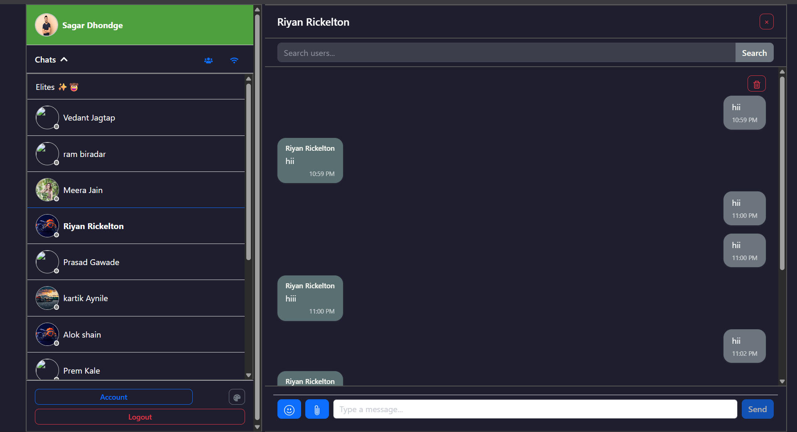
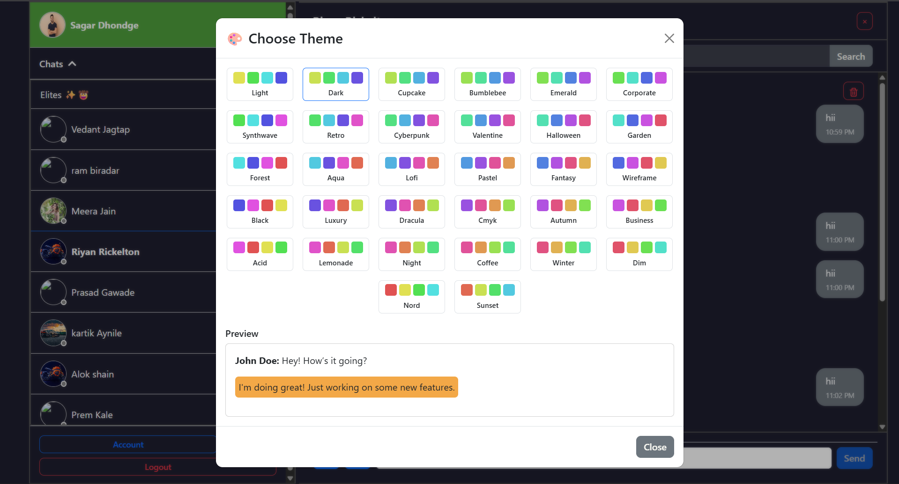

# 💬 ChatVerse – Real-Time Chat Application

ChatVerse is a full-featured real-time messaging app built with the **MERN stack** and **Socket.IO**, offering private chats, group conversations, online presence, file sharing, unread notifications, and theme customization – all wrapped in a responsive, modern UI.

---

## 🚀 Live Demo
🔗 **Frontend**: [https://chat-verse-app-orpin.vercel.app](https://chat-verse-app-orpin.vercel.app)  
🔗 **Backend**: [https://chat-verse-app.onrender.com](https://chat-verse-app.onrender.com)

---

## 🖥️ Screenshots

## 🏠 Home Page



## 🎨 Theme Page




---

## 🔧 Tech Stack

- **Frontend**: React.js, Axios, TailwindCSS / Bootstrap
- **Backend**: Node.js, Express.js
- **Database**: MongoDB (Mongoose)
- **Real-Time**: Socket.IO
- **File Uploads**: Multer
- **Authentication**: JWT + Bcrypt
- **Deployment**: Vercel (Frontend) & Render (Backend)

---

## ⚙️ Features

- ✅ **One-to-One Messaging**
- 👥 **Group Chats with Admin Controls**
- 🎨 **Custom Theme System** with Real-Time Preview
- 🟢 **Online/Offline Presence**
- ✍️ **Typing Indicators**
- 📁 **Send Images, Files, and Text**
- 🔔 **Unread Message Notifications**
- 🔍 **User Search & Add to Groups**
- 👤 **Profile & Avatar Update**
- 📱 **Fully Responsive Design**

---

## 📁 Folder Structure

chatverse/
│
├── backend/
│ ├── controllers/
│ ├── models/
│ ├── routes/
│ ├── config/
│ ├── socketServer.js
│ └── server.js
│
├── frontend/
│ ├── src/
│ │ ├── components/
│ │ ├── context/
│ │ ├── pages/
│ │ ├── utils/
│ │ └── App.jsx
│ └── public/
│
└── README.md


---

## 🛠️ Installation & Setup

### 1. Clone the repository
```bash


git clone :https://github.com/sagardhondge/Chat-Verse-App.git
(https://github.com/sagardhondge/Chat-Verse-App)
cd chatverse


2. Setup Backend
bash

cd backend
npm install
touch .env
.env example

PORT=4000
MONGO_URI=your_mongodb_connection
JWT_SECRET=your_jwt_secret
CLOUDINARY_CLOUD_NAME=your_cloudinary_name
CLOUDINARY_API_KEY=your_key
CLOUDINARY_API_SECRET=your_secret
bash

npm run dev

3. Setup Frontend
bash

cd frontend
npm install
touch .env
.env example


VITE_API_URL=https://chatverse-backend-0c8u.onrender.com
bash

npm run dev
🔒 Environment Variables
Variable	Description
MONGO_URI	MongoDB connection string
JWT_SECRET	Secret key for JWT tokens
CLOUDINARY_*	Cloudinary keys for file uploads
VITE_API_URL	Backend URL used by frontend

👨‍💻 Contributing
Pull requests are welcome! If you'd like to contribute, fork the repo and submit a PR.

📬 Contact
📧 Email: sagardhondge@gmail.com
🔗 LinkedIn: www.linkedin.com/in/sagar-dhondge-764258332


Built  by Sagar Dhondge
